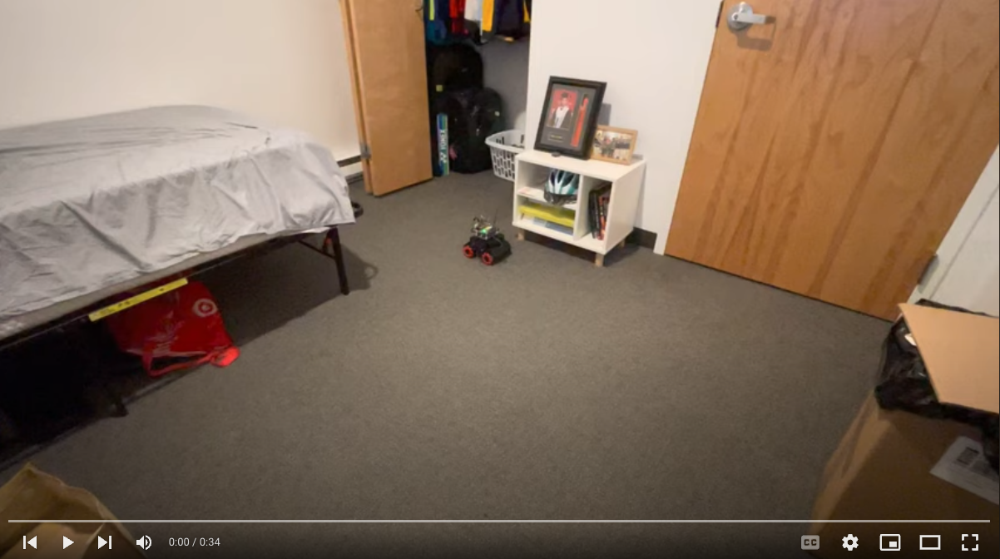
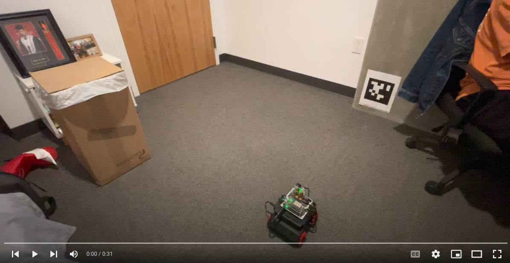
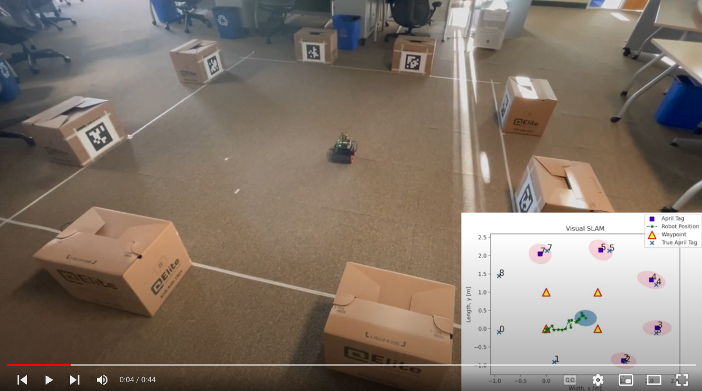
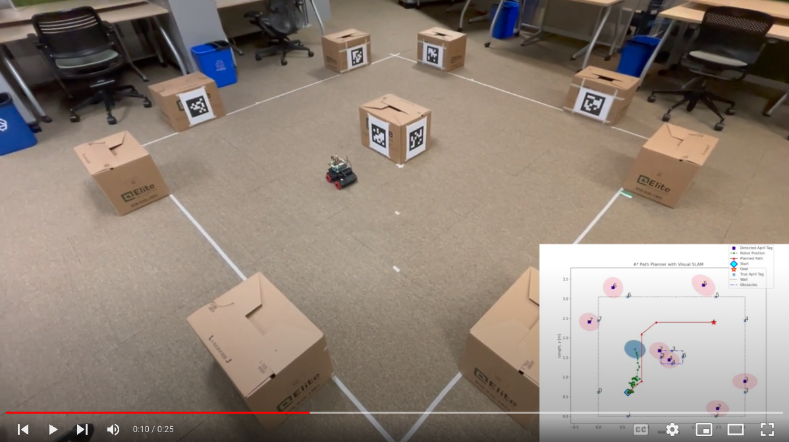
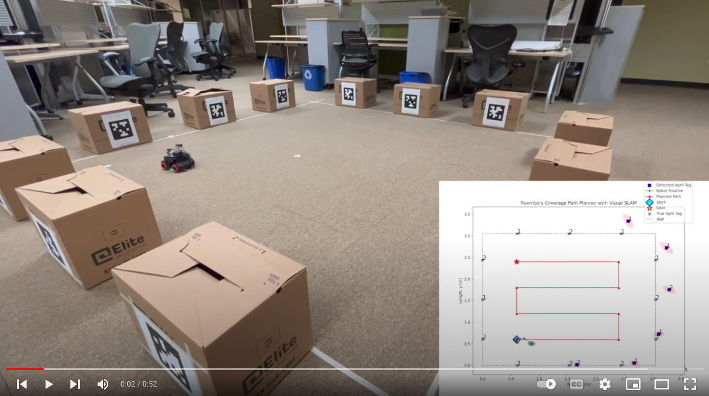

# Qualcomm RB5 Omni-directional Mobile Robot

### Authors: 
1. Kai Chuen Tan @kaitheuser 
2. Hao Yu @caffreyu

Qualcomm RB5 AI Robot OS is an robot operating system (ROS) stack for Qualcomm RB5 Omni-directional Mobile Robot. It is designed to have a "iRobot-Roomba"-liked robotics system that has multiple advanced features including:

1. Real-time Visual Simultaneous Localization and Mapping (vSLAM) using Extended Kalman Filter
2. Multiple Real-time Path Planners with Obstacle Avoidance Feature

    a. A* Path Planning Algorithm

    b. Voronoi Graph-based Path Planning Algorithm

    c. Full Coverage Path Planning Algorithm


# Requirements
## Hardware Requirements
1. mBot Mega Omni-directional Mobile Robot: https://a.co/d/0kR2Ox5 
2. Qualcomm Robotics RB5 Development Kit: https://www.thundercomm.com/product/qualcomm-robotics-rb5-development-kit/ 
3. TalentCell Rechargeable 6000mAh Lithium Ion Battery Pack: https://a.co/d/eAMm6JV
4. One 5.5 mm x 2.1 mm Male to Male Cable Jack Connector/Adaptor: https://a.co/d/0PxdZHI 
5. One 4.8 mm x 1.7 mm Male to 5.5 mm x 2.1 mm Female Cable Jack Connector/Adaptor: https://a.co/d/6piYlT0 

## OS Requirements
1. Ubuntu 18.04
2. ROS Melodic
3. Python 2.7

# Installation and Setup Guide
Qualcomm RB5 Omni-directional Robot Setup Guide: https://docs.google.com/document/d/1lE5VRxwFQ_RxpK8ENAjUE7F59_VxVeKrtLeinQnDE2k/edit?usp=sharing 

# Instructions
## How to Run Open-Loop Control
1. Open `pid_controller.py` script to set hyperparameters.
    
    a. Set `waypoint` in `Line 102`. The array format is [[x_0, y_0, theta_0],...,[x_n, y_n, theta_n]]  .

    b. Set PID constants, i.e., `pid = PIDcontroller(P_const, I_const, D_const)` in `Line 109`.

    c. Save the script.

2. Open terminal and run the `open_loop.launch` launch file with the following command:

    ```roslaunch rb5_control open_loop.launch```

[](https://youtu.be/cIFvSnWTjoo "Qualcomm Robotics RB5 on a mBot Mega Omnidirectional Mobile Robot")

## How to Run Visual Closed-loop Control
1. Open `rb5_visual_servo_control.py` script to set hyperparameters.
    
    a. Set `waypoint` in `Line 140`. The array format is [[x_0, y_0, theta_0],...,[x_n, y_n, theta_n]]  .

    b. Set PID constants, i.e., `pid = PIDcontroller(P_const, I_const, D_const)` in `Line 147`.

    c. Save the script.

2. Open `april_detection_cam_main_new.launch` launch file in the `april_detection` package to set or add april tag pose in the map frame.

3. Open terminal and run the `closed_loop.launch` launch file with the following command:

    ```roslaunch rb5_control closed_loop.launch```

[](https://youtu.be/Jc48e9ZFB6Y "Qualcomm Robotics RB5 Mobile Robot - Visual Servoing Closed-loop Control")

## How to Run Real-time Visual SLAM using EKF
1. Open `rb5_vSLAM.py` script to set hyperparameters.
    
    a. Set RB5 initial pose, `self.mu = np.array([[x_0, y_0, theta_0]]).T ` in map frame in `Line 35`.
    
    b. Set `waypoint` in `Line 206`. The array format is [[x_0, y_0, theta_0],...,[x_n, y_n, theta_n]]  .

    c. Set PID constants, i.e., `pid = PIDcontroller(P_const, I_const, D_const)` in `Line 241`.

    d. Set motion and sensor noise, `ekf_vSLAM = EKF_vSLAM(var_System_noise=[variance_linear_motion, variance_rotation], var_Sensor_noise=[variance_range, variance_relative_angle])` in `Line 244`

    e. Save the script.

2. Open terminal and run the `rb5_vSLAM.launch` launch file with the following command:

    ```roslaunch rb5_control rb5_vSLAM.launch```

[](https://youtu.be/aTLilUzDVxc "Qualcomm RB5 Omnidirectional Robot - Real-time EKF Visual SLAM (Multiple Squares Path)")

## How to Run Real-time Path Planner and Visual SLAM using EKF
1. Open `rb5_vSLAM_Path_Planning.py` script to set hyperparameters.
    
    a. Set or add walls, `dict_wall_lm['landmark_ID'] = [x_center, y_center]` in map frame from `Line 25` to `Line 32`.

    b. Set or obstacles, `dict_obs_lm['obstacle_ID'] = [x_center, y_center]` in map frame from `Line 34` to `Line 37`.

    c. Set RB5 start position, `rb5_start = [x_start, y_start]` in map frame in `Line 39`.

    d. Set RB5 goal position, `rb5_start = [x_goal, y_goal]` in map frame in `Line 40`.

    e. Set map's cell size, `cell_size` in `Line 42`.

    f. Set configuration space, `rb5_clearance` in `Line 43`.

    g. Set waypoint radius, `goal_tol` in `Line 44`.

    h. Set path planner visualization, `verbose` in `Line 45`.

    i. Select a path planner algorithm, `path_planner` in `Line 52`.

    j. Set PID constants, i.e., `pid = PIDcontroller(P_const, I_const, D_const)` in `Line 318`.

    k. Set motion and sensor noise, `ekf_vSLAM = EKF_vSLAM(var_System_noise=[variance_linear_motion, variance_rotation], var_Sensor_noise=[variance_range, variance_relative_angle])` in `Line 321`

    l. Set RB5 initial pose, `current_state` in `Line 324`.

    m. Save the script.

2. Open `rb5_vSLAM.py` script to set hyperparameter.
    
    a. Set RB5 initial pose, `self.mu = np.array([[x_0, y_0, theta_0]]).T ` in map frame in `Line 35`.

    b. Save the script.

3. Open terminal and run the `rb5_Path_Planning_vSLAM.launch` launch file with the following command:

    ```roslaunch rb5_control rb5_Path_Planning_vSLAM.launch```

[](https://youtu.be/LNtuhxP6C74 "Qualcomm RB5 Omnidirectional Robot - Real-time Path Planning and EKF Visual SLAM (A*)")


## How to Run Real-time Full Coverage Path Planner and Visual SLAM using EKF just Like iRobot Roomba Intelligent Vacuum Robot
1. Open `run_rb5_Roomba.py` script to set hyperparameters.
    
    a. Set or add walls, `dict_wall_lm['landmark_ID'] = [x_center, y_center]` in map frame from `Line 25` to `Line 36`.

    b. Set the safety distance between path and wall, `safety_Dist` in `Line 43`.

    c. Set coverage width, `lane_Width` in `Line 44`.

    d. Set map's cell size, `cell_size` in `Line 45`.

    e. Set configuration space, `rb5_clearance` in `Line 46`.

    f. Set waypoint radius, `goal_tol` in `Line 47`.

    g. Set path planner visualization, `verbose` in `Line 48`.

    h. Set PID constants, i.e., `pid = PIDcontroller(P_const, I_const, D_const)` in `Line 394`.

    i. Set motion and sensor noise, `ekf_vSLAM = EKF_vSLAM(var_System_noise=[variance_linear_motion, variance_rotation], var_Sensor_noise=[variance_range, variance_relative_angle])` in `Line 398`

    j. Set RB5 initial pose, `current_state` in `Line 401`.

    k. Save the script.

2. Open `rb5_vSLAM_Pro.py` script to set hyperparameter.
    
    a. Set RB5 initial pose, `self.mu = np.array([[x_0, y_0, theta_0]]).T ` in map frame in `Line 38`.

    b. Save the script.

3. Open terminal and run the `roomba_OS.launch` launch file with the following command:

    ```roslaunch rb5_control roomba_OS.launch```

[](https://youtu.be/CA4QbiJDwBw "Qualcomm RB5 Omnidirectional Robot - Roomba-like Robotics Systems with Real-time Full Coverage Path")